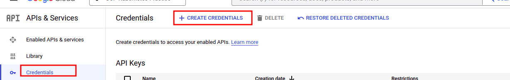

# DIHX front end application

## Steps to implement Security

1. Add dependency to pom.xml
  ``` <dependency>
   <groupId>org.springframework.boot</groupId>
   <artifactId>spring-boot-starter-oauth2-client</artifactId>
   <version>2.3.3.RELEASE</version>
   </dependency>
  ```
2. Create Google credentials.
    * Go to Google API Console https://console.cloud.google.com/apis/dashboard?pli=1
    * Go to credentials to create OAuth Client ID for the web applications.
        
    * In Create OAuth Client ID Screen
      * Select Application type > Web Application
      * Give appropriate Name
      * Add below URL as Authorized Redirect URIs.
        * http://<hostname>:<port>/login/oauth2/code/google
          * 
      * Click on "Create"
      * OAuth client will be created and pop-up containing client Id and secret key will appear. Copy these details as mentioned in Step# 3.
        * 
3. Copy this properties and replace the values of them with the client id and secren generated as part of Step# 2
     - spring.security.oauth2.client.registration.google.client-id=<your client id>
     - spring.security.oauth2.client.registration.google.client-secret=<your client secret>

